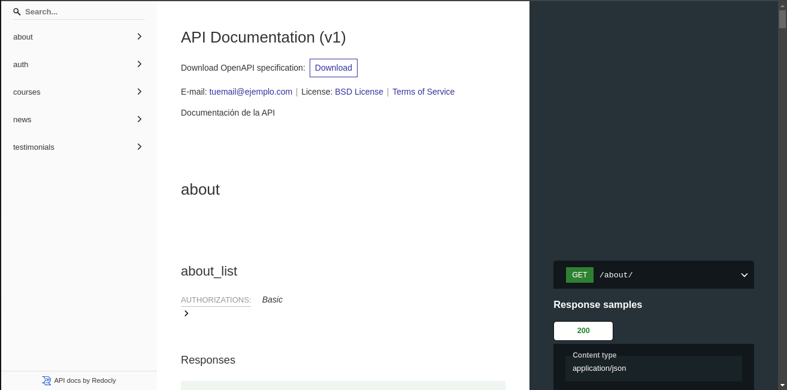

# Backend hecho con Django Rest Framework para la materia de Electiva de Area 1
### El cual es para la aplicacion movil hecha con Kotlin que va a servir como puente de comunicacion y documentacion entre las entidades universitarias del area y los futuros posibles nuevos ingresos, dando mas informacion sobre la carrera de ingenieria en informatica asi, buscando de aumentar la matricula estudiantil del area y ademas, evitar el desconocimiento de la carrera en general

[Ver en produccion](https://drf-api-libre-1.onrender.com/)

